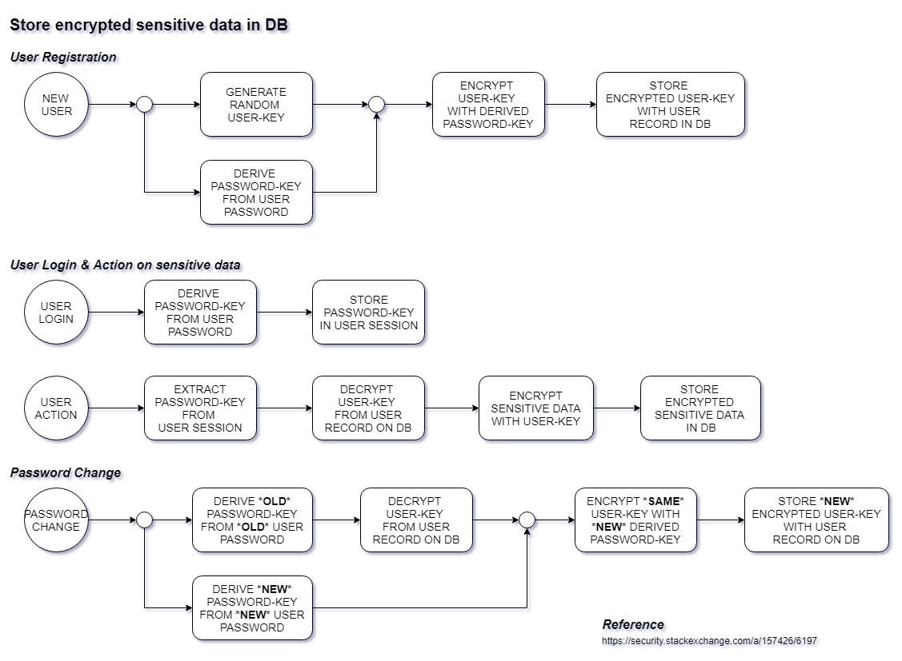

**Semester**|**Kurs**|**Datum**
-----|-----|-----
WiSe 2023|Datenbanken 2|18.01.2024

# Notes
Online-Notizapp mit Verschlüsselung.

> Bei diesem Projekt handelt es sich um ein benotetes Projekt.



## Technische Aspekte
- SvelteKit
- Tailwind CSS
- MongoDB (über [`mongoose`](https://github.com/Automattic/mongoose))
- Redis (über [`ioredis`](https://github.com/redis/ioredis))
- Natives Krypto-Modul [`node:crypto`](https://nodejs.org/api/crypto.html)
    - AES-256-CBC
    - Scrypt

## Verwendung
1. Dependencies mit NPM oder PNPM installieren 
```bash
$ npm install
```

2. Umgebungsvariablen konfigurieren
    - `.env.development` im Projektverzeichnis erstellen (siehe `.env.example`)

3. Ausführen (Development-Modus)
```bash
$ npm run dev
```

Im Browser anschließend http://localhost:3000 öffnen.